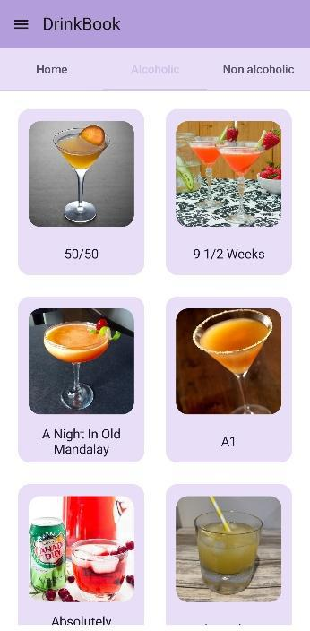
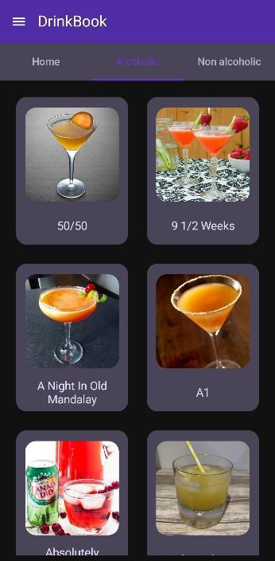
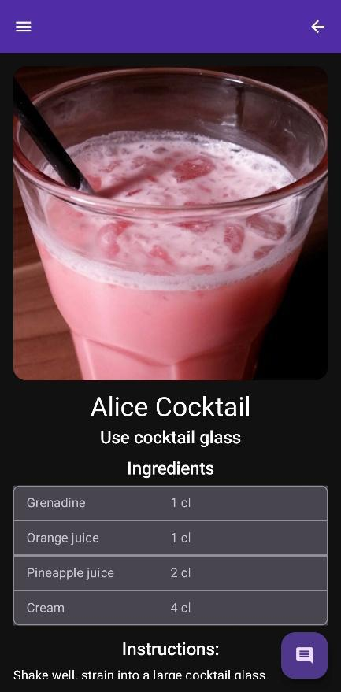
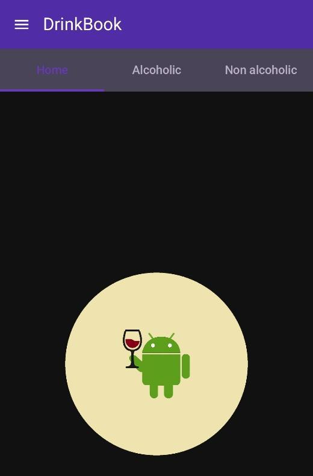
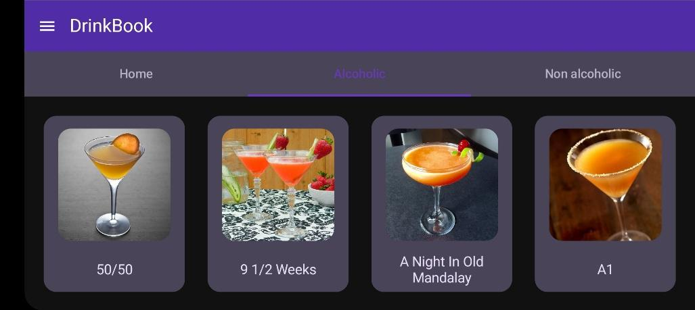
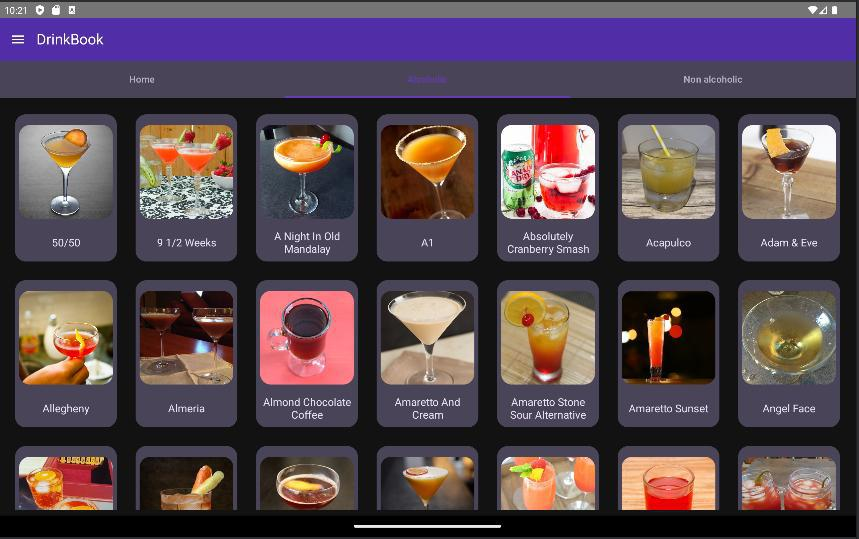
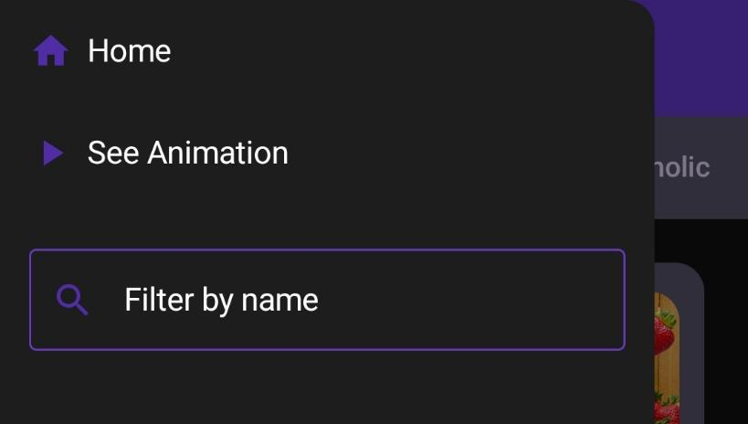
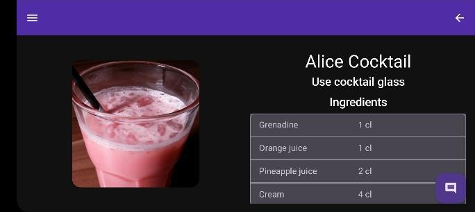
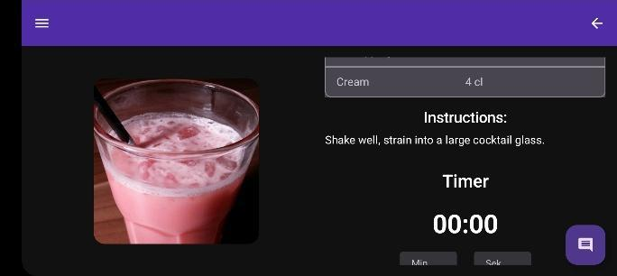
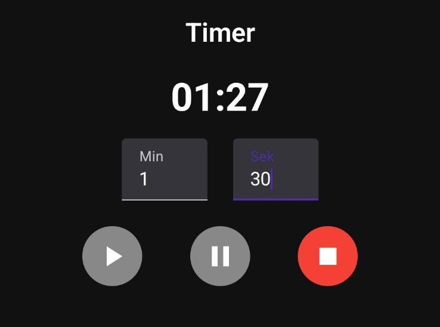

# 🍷 DrinkBook

## ℹ️ O projekcie

#### [🇬🇧 English version](#ℹ️-about-the-project)

Aplikacja powstała na przedmiocie `Aplikacje mobilne`, na VI semestrze studiów pierwszego stopnia na kierunku Informatyka na Politechnice Poznańskiej.

### ✅ Główne cechy aplikacji

* Aplikacja zawiera przepisy na 80 popularnych drinków, zarówno alokoholowych jak i bezalkoholowych
* Zarówno przepisy, jak i zdjęcia pochodzą ze strony [TheCocktailDB](https://www.thecocktaildb.com/)
* Aplikacja przechowuje drinki w lokalnej, niemodyfikowalnej bazie danych, która jest załączona w plikach projektu
* Aplikacja zawiera animację startową, użytkownik może wejść w interakcję z nią poprzez potrząsanie telefonem; animację tę można też wywołać w dowolnym momencie
* Główny ekran aplikacji posiada szufladę, w której znajduje się pole do wyszukiwania drinków
* Na głównym ekranie znajdują się trzy karty, grupujące różne rodzaje drinków, między którymi można dowolnie przechodzić
* Przefiltrowane drinki ustawiane są w siatce, można przejść do szczegółów napoju
* Na stronie szczegółów znajdują się składniki i przepis oraz sekcja minutnika
* Aplikacja obsługuje:
  * zmianę orientacji ekranu
  * różne rozmiary ekranu
  * dwa motywy

### 🛠️ Użyte narzędzia, języki i technologie

* Android Studio
* Kotlin
* Jetpack Compose
* Room DB
* DB Browser for SQLite

### 🚀 Uruchomienie aplikacji

1. Sklonuj repozytorium
2. Otwórz w Android Studio
3. Uruchom aplikację na emulatorze lub własnym urządzeniu
4. Jeżeli chcesz dodać lub usunąć drinki, zmodyfikuj plik [import drinks](app/src/main/assets/import_drinks.db) przed instalacją

### 👥 Autorzy

* [Jakub Pilarski](https://github.com/jpilarski)
* [Wojciech Gładysz](https://github.com/ThrillMan)

### [📷 Galeria](#gallery)

## ℹ️ About the project

#### [🇵🇱 Wersja polska](#ℹ️-o-projekcie)

The application was created for the `Mobile applications` course during the 6th semester of the Bachelor's degree in Computer Science at Poznan University of Technology.

### ✅ Main features of the application

* Contains recipes for 80 popular drinks, both alcoholic and non-alcoholic
* Recipes and images are sourced from [TheCocktailDB](https://www.thecocktaildb.com/)
* Drinks are stored in a local, non-editable database included in the project files
* The app features a launch animation that can be interacted with by shaking the phone; the animation can also be triggered at any time
* The main screen includes a navigation drawer with a search bar for finding drinks
* Three main cards group different drink categories; users can switch between them freely
* Filtered drinks are displayed in a grid layout with access to detailed drink information
* The detail view includes ingredients, instructions, and a timer section
* The app supports:
  * screen orientation changes
  * various screen sizes
  * light and dark themes

### 🛠️ Tools, languages, and technologies used

* Android Studio
* Kotlin
* Jetpack Compose
* Room DB
* DB Browser for SQLite

### 🚀 Launching the application

1. Clone the repository
2. Open it in Android Studio
3. Run the app on an emulator or a physical device
4. If you want to add or remove drinks, modify the [import drinks](app/src/main/assets/import_drinks.db) file before installation

### 👥 Authors

* [Jakub Pilarski](https://github.com/jpilarski)
* [Wojciech Gładysz](https://github.com/ThrillMan)

### 📷 Gallery

<table align="center" style="border-collapse: separate; border-spacing: 20px 10px; margin: auto;">
  <tr>
    <td></td>
    <td></td>
    <td></td>
    <td></td>
  </tr>
  <tr>
    <td colspan=2></td>
    <td colspan=2></td>
  </tr>
  <tr>
    <td colspan=2></td>
    <td colspan=2></td>
  </tr>
  <tr>
    <td colspan=2></td>
    <td colspan=2></td>
  </tr>
  <tr>
    <td colspan=2></td>
    <td colspan=2></td>
  </tr>
</table>
